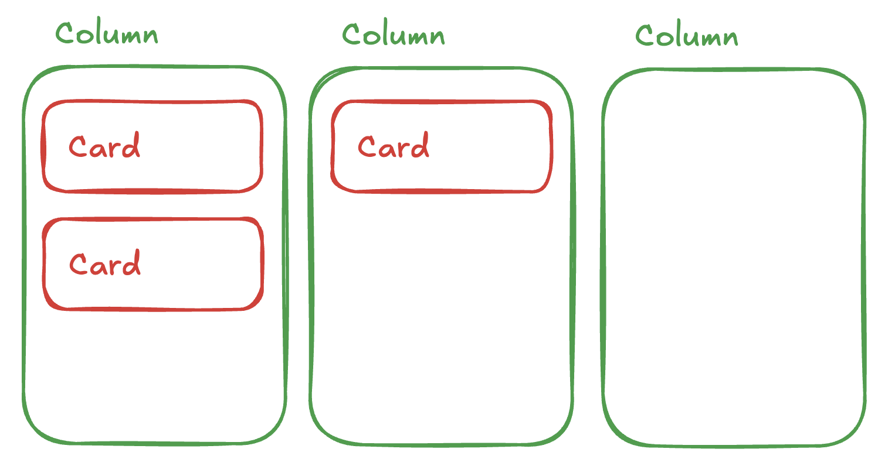
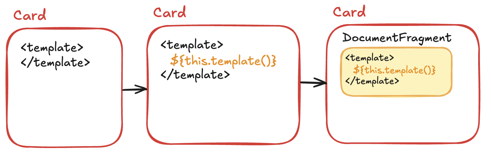
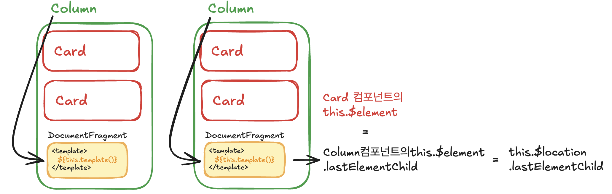
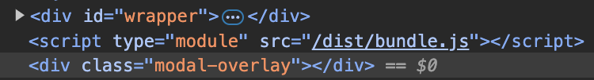

# 📒 고민 배경

### A. 컴포넌트 구조를 갖추기 전

바닐라 자바스크립트를 통해 간단한 풀스택 프로젝트를 시도해보고 있다. 리액트를 제대로 써본 적도, 사용자의 복합한 상호작용에 대한 프론트엔드 스크립트도 작성해 본 적이 없다. 처음에는 단순히 `기능을 기준으로` 아래와 같이 개발하였다.

```markdown
/javascripts
├─ Cards
│  ├─ create.js
|  ├─ update.js
|  ├─ delete.js
|  ├─ index.js
├─ Menu
|  ├─ index.js
... 
```

해당 방식은 다음의 불편함이 있었다.

- ***각 기능에서 사용되는 엘리먼트들이 “엮여있는” 경우가 많다.***

→ 이때문에 getClosest를 사용해서 항상 연결되어 있는 DOM트리를 타고타고 들어가서 엘리먼트를 찾는 과정이 반복된다. 

- ***하나의 기능에 관여하는 여러 엘리먼트, 이벤트 등록 등 일련의 모든 흐름이 하나의 파일에 묶여있다.***

→ 수정비용이 크다. 특정 기능이 추가되거나 또다른 엘리먼트가 관여하게 될때 어느 파일의 어떤 함수를 수정해야 할지 찾고 판단하는 것이 일관적으로 유지되기 어렵다. 

여기서, 위의 불편함들을 구체적으로 다루지는 않겠다. 이를 [컴포넌트 구조로 리팩토링한 과정을 담은 글📝]에서 더 자세히 담아보고자 한다.

### B. 내가 선택한 컴포넌트의 형태

각 컴포넌트들은 기본 Component 클래스를 상속받아 구현되도록 하였다. 코드를 살펴보자.

```jsx
class Component {
  constructor($location, props) {
    this.$location = $location;
    this.$element = null;
    this.html = null;
    this.initializeState();
    this.props = props;
    this.render();
  }

  initializeState() {
    this.state = {};
  }

  template() {
    return '';
  }

  addEvent() {}

  createFragment() {
    const fragmentRoot = document.createElement('template');
	  ...(생략) 
  }

  render() {
    const fragment = this.createFragment();
	  ...(생략) 
	  this.$element = this.$location.lastElementChild;
    this.addEvent();
  }

  reRender() {
    const fragment = this.createFragment();
    ...(생략) 
    this.$element = newElement;
    this.addEvent();
  }

  setState(newState) {
    this.state = {
      ...this.state,
      ...newState,
    };
    this.reRender();
  }
}

export default Component;

```

컴포넌트가 생성될 때는 크게 2가지의 값을 받아 생성된다.

1. 컴포넌트가 삽입될 위치 (부모 엘리먼트)
2. 부모로부터 넘겨받는 데이터 (props)

이를 기반으로 생성자에서 초기화 과정을 거친다.

1. `initializeState()` 메서드를 통해 초기 상태를 정의할 수 있다.
2. props를 멤버 변수로 저장한다.
3. `render()` 메서드를 통해 컴포넌트에서 template()메서드로 정의한 html을 DOM에 반영한다.
    1. $element라는 멤버변수로 render() 메서드를 통해 반영한 컴포넌트를 대표하는 엘리먼트를 저장한다.
    2. $element를 기준으로 `addEvent()` 메서드를 통해 이벤트를 등록한다.

### 🤔 this.$element를 왜 저장하는가?

기존의 기능 단위 구조에서 컴포넌트 구조로 바꾸었던 가장 큰 이유는, Card와 같은 컴포넌트 단위로 자식 엘리먼트를 찾고, 이벤트를 등록하기 위해서였다. 

이렇게 컴포넌트 기준으로 생성된 엘리먼트에서만 요소를 빠르게 찾고 이벤트를 등록하려면, this.$element의 존재가 필요하다고 판단했다. this.$element를 통해 자신의 컴포넌트의 자식 컴포넌트를 생성하면서 부모 엘리먼트로 this.$element를 전달할 때도 있다.

```jsx
this.$element.querySelector('셀렉터')
```

# 🚨 html문자열을 통해 생성한 컴포넌트의 대표 엘리먼트를 어떻게 저장하지?

## A. 초기 방식

Component 클래스는 생성할 때 삽입될 위치(부모 엘리먼트)를 기반으로 렌더링되므로, 처음에는 부모 엘리먼트의 마지막 자식값을 기준으로 저장하면 된다고 생각했다.

예를 들어, 각 Column 컴포넌트의 자식으로 Card 컴포넌트가 생성된다고 하자.



Card 컴포넌트는 자신의 template메서드의 리턴값으로 html 문자열을 정의한다. 이 html 문자열을 생성자에서 정의한 부모 엘리먼트(this.$location)의 자식으로 삽입하면 된다. 

코드는 다음과 같다. 

```jsx
  createFragment() {
    const fragmentRoot = document.createElement('template');
    fragmentRoot.innerHTML = this.template();
    const fragment = document.createDocumentFragment();
    fragment.appendChild(fragmentRoot.content.firstElementChild);
    return fragment;
  }

  render() {
    const fragment = this.createFragment();
    this.$location.insertAdjacentElement('beforeend', fragment.firstElementChild);
    this.$element = this.$location.lastElementChild;
    this.addEvent();
  }
```

1. template태그를 최상위로 하고, innerHTML에 해당 컴포넌트의 template 메서드 리턴값을 넣는다.
2. DocumentFragment를 생성하고 이 DOM조각의 루트를 방금 생성한 template 태그로 한다.



1. 삽입할 위치(부모 엘리먼트)의 마지막 자식으로 insertAdjacentElement을 통해 DOM조각을 삽입한다.
2. 부모 엘리먼트(this.$locatioin)의 마지막 자식을 this.$element에 컴포넌트가 생성한 엘리먼트로서 멤버 변수로 저장한다. 



## B. 문제 인식

하지만 위의 나의 방식은 치명적인 문제가 있었다

> (1) 각 컴포넌트에서 정의한 템플릿 html 문자열에 한 개의 상위 태그로 감싸져 있지 않을 때, 두 번째 태그부터 렌더링되지 않는다.
(2) DocumentFragment 생성이 꼭 필요했을까?
> 

### (1) 템플릿이 한 개의 상위 태그로 감싸져 있지 않을 때의 문제

```html
<div class="modal-overlay"></div>
<div class="modal-container"></div>
```

모달이 생성될 때 화면을 뒤덮는 overlay와 실제 모달 창이 뜬다. Modal 컴포넌트에서는 간단하게 위와 같은 템플릿으로 렌더링을 한다.

이때 개발자 도구를 확인해보면, modal-overlay만 화면에 반영되는 문제점을 알 수 있다.



```jsx
createFragment() {
  const fragmentRoot = document.createElement('template');
  fragmentRoot.innerHTML = this.template();
  const fragment = document.createDocumentFragment();
  **fragment.appendChild(fragmentRoot.content.firstElementChild);**
  return fragment;
}

render() {
  const fragment = this.createFragment();
  this.$location.insertAdjacentElement('beforeend', fragment.firstElementChild);
  this.$element = this.$location.lastElementChild;
  this.addEvent();
}
```

### 🔥 오류의 핵심

1. fragmentRoot.content에 `<modal-overlay><modal-container>`가 있다. 이중 firstElementChild로 첫 번째 자식만 fragment에 삽입하였다.

```jsx
fragment.appendChild(fragmentRoot.content.firstElementChild);
```

1. fragment.content로 `<modal-overlay><modal-container>`를 모두 담아도 render메서드에서 **fragment.firstElementChild**만 실제 DOM에 삽입하고 있다. 

```jsx
  this.$location.insertAdjacentElement('beforeend', fragment.firstElementChild);
```

### (2) DocumentFragment 사용의 의미

일단, 내가 실수한 가장 큰 부분은 template 태그의 특성을 제대로 이해하지 못했다는 점이다.

template태그는 내부의 내용믈을 DocumentFragment로 담는다. 

- content 속성을 통해 이 DocumentFragment에 쉽게 접근할 수 있다.
- template 안의 내용물은 렌더링되지 않으므로 특정 템플릿을 필요할 때마다 cloneNode를 통해 복제하고 
+ 원하는 DOM조작을 렌더링 전에 하고, 최종 결과물만 실제 DOM에 반영할 수 있다.

그런데 기존의 나의 코드에서는 ***template태그 자식으로 내용물을 채우고, 이미 fragment로 만들어진 일부를 또다시 DocumentFragment의 자식에 삽입하는 불필요한 과정을 거친다.***

### 🔥 로직 모순의 핵심

상위 태그가 여러 개일 때, 이를 감싸는 방식으로 DocumentFragment또는 template을 사용하면 무엇이 문제일까? 

- ***렌더링하는 것은 문제가 되지 않는다.*** cloneNode메서드를 사용하면 fragment에 여러 개의 최상위 태그가 있어도 이를 그대로 Node 객체로서 복제한다.
- 이글의 목표였던 ***this.$element에 렌더링한 Node객체를 저장하는 것이 문제가 된다.*** DocumentFragment는 실제 DOM에 반영되면 안의 내용물이 비워진다. 따라서 addEvent메서드에서 this.$element로 특정 엘리먼트들에 접근하여 이벤트를 등록할 수 없다.

***→ addEvent메서드 실행을, fragment가 실제 DOM에 반영되기 전에 하면 되지 않을까?***

현재 구조에서는 불가능하다. 일부 Component에서 조건에 따라 내용물을 다르게 렌더링하는 경우 this.$element.querySelector를 통해 엘리먼트에 접근하는 경우가 있다. 해당 방식은 이벤트 등록 문제는 해결되겠지만, 일부 컴포넌트의 정상적인 렌더링을 해친다.

```jsx
  render() {
    super.render();
    this.renderHistories();
  }

  reRender() {
    super.reRender();
    this.renderHistories();
  }

  renderHistories() {
    const $menuMain = this.$element.querySelector('.menu_main');
    $menuMain.innerHTML = '';
    ...
    [...this.state.histories].reverse().forEach((history) => {
      new History($menuMain, { history });
    });
  }
```

# 🔨 결론

최종적인 해결책은, “template의 최상위 태그가 2개 이상일 때만” **render메소드에서 div를 최상위 태그로 활용하여 감싸는 방법**이다. 

- 최상위 태그가 1개일 때 모두 div태그로 감싸버리면 아래와 같이 자신의 컴포넌트에서 렌더링한 최상위 태그의 자식으로 새로운 컴포넌트를 추가할 때 의도한 대로 동작하지 않을 수 있다.

```jsx
renderColumns() {
    const $main = this.$element;
    const { tasks } = this.state;
    new Column($main, {
      title: '해야할 일',
      tasks: tasks.filter((task) => task.category_id === 1),
      categoryId: 1,
    });
    ...
  }
}
```

- template이나 fragment를 사용하여 2개 이상의 태그를 감싸면 위에서 지적한 것처럼 this.$element로 접근하여 사용할 때 안의 내용물이 비어 제대로된 DOM 조작을 할 수 없다.

최종적으로  template메서드 반환값을 통해 fragment를 생성한 이후에, 최상위 태그의 개수에 따라 div로 감싸주거나, 최상위 태그 하나만을 this.$element로 저장하는 과정을 거치도록 수정했다. 

```jsx
parseTemplate() {
    const template = document.createElement('template');
    template.innerHTML = this.template().trim();
    const fragment = template.content;
    if (fragment.childElementCount < 2) return fragment.firstElementChild;

    // 최상위 태그 2개 이상
    const wrapper = document.createElement('div');
    wrapper.append(...fragment.children);
    return wrapper;
  }

  render() {
    this.$element = this.parseTemplate();
    this.$location.appendChild(this.$element);
    this.addEvent();
  }

  reRender() {
    const newElement = this.parseTemplate();
    this.$element.replaceWith(newElement);
    this.$element = newElement;
    this.addEvent();
  }
```

# ✨ 회고

- Document, Node 객체, Element 객체 등. DOM API의 반환값이나 인자 형태에 대한 “타입” 구분을 하지 않고 무분별하게 사용한 것이 이상한 코드의 시작점이었다.
- DocumentFragment, template의 특성 및 구체적인 작동 원리를 모르는 상태에서 “성능상 좋다”는 말만 듣고 사용한 것 같다. 이는 근거 없고 책임감 없는 코드를 작성하는 나쁜 습관이었다. 절대 반복하지 말자.