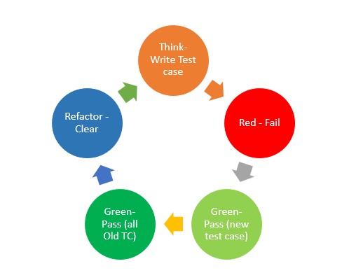

# TDD & BDD

## TDD

테스트 주도 개발(TDD)은 테스트를 작성하여 소프트웨어 개발을 안내하는 소프트웨어 구축 기법입니다. 1990년대 후반에 켄트 벡이 익스트림 프로그래밍의 일부로 개발했습니다.

TDD의 프로그래밍 순서는 다음과 같습니다:

1. 실패하는 작은 단위 테스트를 작성한다. 처음에는 컴파일조차 되지 않을 수 있다.
2. 빨리 테스트를 통과하기 위해 프로덕션 코드를 작성한다. 이를 위해 정답이 아닌 가짜 구현 등을 작성할 수도 있다.
3. 그다음의 테스트 코드를 작성한다. 실패 테스트가 없을 경우에만 성공 테스트를 작성한다.
4. 새로운 테스트를 통과하기 위해 프로덕션 코드를 추가 또는 수정한다.
5. 1~4단계를 반복하여 실패/성공의 모든 테스트 케이스를 작성한다.
6. 개발된 코드들에 대해 모든 중복을 제거하며 리팩토링한다.



이를 Red, Green, Blue 3단계로 나눠 더 간단하게 나타낼 수 있습니다.

- Red : 실패하는 테스트 코드를 작성한다.
- Green : 테스트 코드를 성공시키기 위한 실제 코드를 작성한다.
- Blue : 리팩터링을 수행한다.

마틴 파울러의 블로그에서는 TDD에 중요한 두 가지 이점이 있다고 설명합니다.

- 테스트 통과에 대한 응답으로 일부 기능 코드를 우선 작성할 수 있기 때문에 셀프 테스트 코드를 얻을 수 있습니다.
- 테스트 코드를 우선 적으로 작성하면 코드의 인터페이스에 대해 먼저 생각하게 됩니다. 이를 통해 프로그래머는 인터페이스와 구현을 분리하는 데 도움이 됩니다.

또한 리팩터링이 프로세스의 포함됨으로 코드를 깔끔하게 유지할 수 있습니다. (테스트 코드도 이미 작성되어 있으므로 리팩터링의 부담을 줄여줍니다.)

## BDD

행동 주도 개발(BDD, **Behavior-driven development**)은 TDD의 확장으로 도메인 언어를 사용하여 코드의 동작을 설명하는 소프트웨어 테스트의 이름을 지정하는 것입니다.

BDD의 핵심은 애자일 방법론을 통해 개발자와 비 개발자인 이해관계자들의 협업을 통해 소프트웨어의 동작(behavior)을 명확하게 정의하고 이러한 자연어를 기반으로 개발과 테스트를 진행하는 방식을 의미합니다.

### Given - When - Then

Given-When-Then은 테스트 코드를 작성하는 표현 방식입니다.

> [여기](https://martinfowler.com/bliki/GivenWhenThen.html)에서 마틴 파울러의 글을 읽어볼 수 있습니다.

> Given-When-Then은 테스트를 표현하는 스타일, 또는 그 옹호자들이 말하는 것처럼 SpecificationByExample을 사용하여 시스템의 동작을 지정하는 스타일입니다.
>
> 이는 행동 중심 개발(BDD)의 일부로 Daniel Terhorst-North와 Chris Matts가 개발한 접근 방식입니다. Cucumber와 같은 많은 테스트 프레임워크의 구조화 접근 방식으로 나타납니다. 4단계 테스트 패턴을 재구성한 것으로 볼 수도 있습니다.
>
> 시나리오(또는 테스트) 작성을 세 가지 섹션으로 나누는 것이 핵심 아이디어입니다.
>
> - Given : 이 시나리오에서 지정하는 동작을 시작하기 전의 월드 상태를 설명합니다. 테스트의 전제 조건이라고 생각하면 됩니다.
> - When : 사용자가 지정하는 동작입니다.
> - Then : 지정된 동작으로 인해 예상되는 변경 사항을 설명합니다.

```ts
기능: 사용자 주식 거래
	시나리오: 사용자가 거래 마감 전에 매도를 요청합니다

		//Given
		내가 MSFT 주식 100주를 가지고 있고
			APPL 주식 150주를 가지고 있으며
			시간은 거래 마감 전입니다

		 //When
		 내가 MSFT 주식 20주를 매도하도록 요청하면


		 //Then
		 나는 MSFT 주식 80주를 가지고 있어야 하고
			 APPL 주식 150주를 가지고 있어야 합니다
			 그리고 MSFT 주식 20주에 대한 매도 주문이 실행되었어야 합니다.
```
